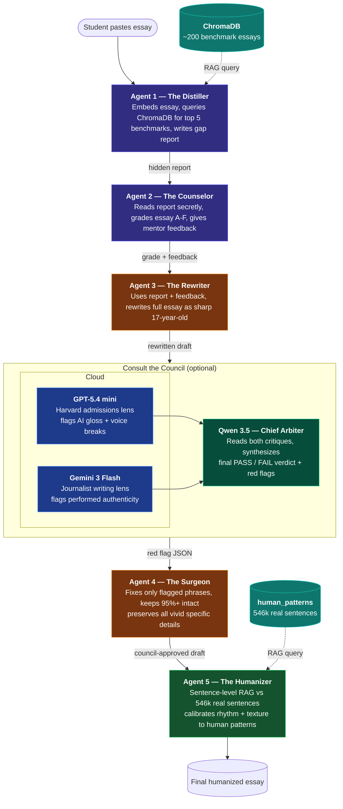

# RAG Essay Forge: AI Academic Writing & Distillation Pipeline

Welcome to **RAG Essay Forge**, a powerful multi-agent architecture built locally to process, critique, rewrite, and humanize essays. While originally designed for college admissions, the system has evolved into a comprehensive **General Academic Essay Pipeline**, utilizing eight highly specialized agents to analyze and elevate student writing at any grade level (Middle School, High School, or Undergraduate).

The application is powered fully locally via LM Studio, utilizing robust Retrieval-Augmented Generation (RAG) and high-context LLMs to provide unmatched privacy, security, and zero-shot precision.

---

## 🌟 The Core Pipeline: General Academic Essay Writing

The flagship feature of the RAG Essay Forge is the **Essay Helper**. When a student submits a standard academic essay (Argumentative, Analytical, Narrative, etc.), three specialized agents take over sequentially:

1. **Agent 6 — The Examiner:** Acts as a strict academic grader. Evaluates the thesis clarity, argument structure, transitions, and evidence quality based on the specified grade level.
2. **Agent 7 — The Rewriter:** An expert academic tutor. It absorbs the Examiner's critique and structurally rebuilds the essay, fixing logical flow without hallucinating new facts or stripping the student's original voice.
3. **Agent 8 — The Coach:** A patient mentor providing an encouraging, post-rewrite summary. The Coach highlights what the student did well, explains the 3 most important changes made by the Rewriter, and suggests a specific writing habit to practice based on the student's tendencies.

This triad ensures that students aren't just given rewritten text, but receive rigorous, actionable feedback to become better academic writers.

---

## 🏛 The Specialized Pipeline: College Admissions Distillation

For high-stakes college admissions, the Forge utilizes a deep, five-stage RAG-augmented distillation process designed to break down and reconstruct competitive applications. 

### Architecture Diagram



#### Pipeline Steps:
1. **The Distiller (RAG):** Evaluates the essay against 200+ accepted college essays stored in a local vector database.
2. **The Counselor:** Synthesizes the benchmark data to assign a harsh grade (A-F) alongside conversational critique.
3. **The Rewriter:** Attempts a complete baseline polish of the draft.
4. **The Surgeon (with External Cloud Council):** Re-evaluates the rewritten draft against a diverse AI jury (simulating Harvard readers and high-level journalists). It explicitly corrects any "plastic" AI-isms the Rewriter inserted without destroying the student's personal details.
5. **The Humanizer (RAG):** Cross-references 546,000 real student sentences to inject burstiness, variable perplexity, and grammatical imperfection back into the essay so it passes advanced AI-detection heuristics and sounds authentically 17-years-old.

---

## 🛠 Setup & Installation

### Requirements
* Python 3.8+
* [LM Studio](https://lmstudio.ai/) running locally on port `1234`
* Optional: Provide large token context limit (e.g. 30,000 tokens) in LM Studio for maximum Humanizer performance.

### Quick Start
1. **Install dependencies:**
    ```bash
    pip install -r requirements.txt
    ```
2. **Start LM Studio Local Server:**
    Ensure LM studio is running a compatible model (e.g. `gemma-4-26B`) and the local server is spun up on `http://localhost:1234`. Make sure "Context Length" is turned up.
3. **Launch the FastAPI Web Application:**
    ```bash
    python -m uvicorn app:app --reload
    ```
4. **Access the Application Interface:**
    Navigate to `http://localhost:8000` in your web browser. 

Use the tabs at the top of the interface to switch contexts between the general **Essay Helper** ecosystem, the specialized **College Essay** pipeline, or the standalone **Humanizer**.

*For developers pushing changes to deployment environments, ensure your `.env`, SQLite Vector DB (`essay_db`), and generated `.pyc` caches are safely ignored via `.gitignore`.*
